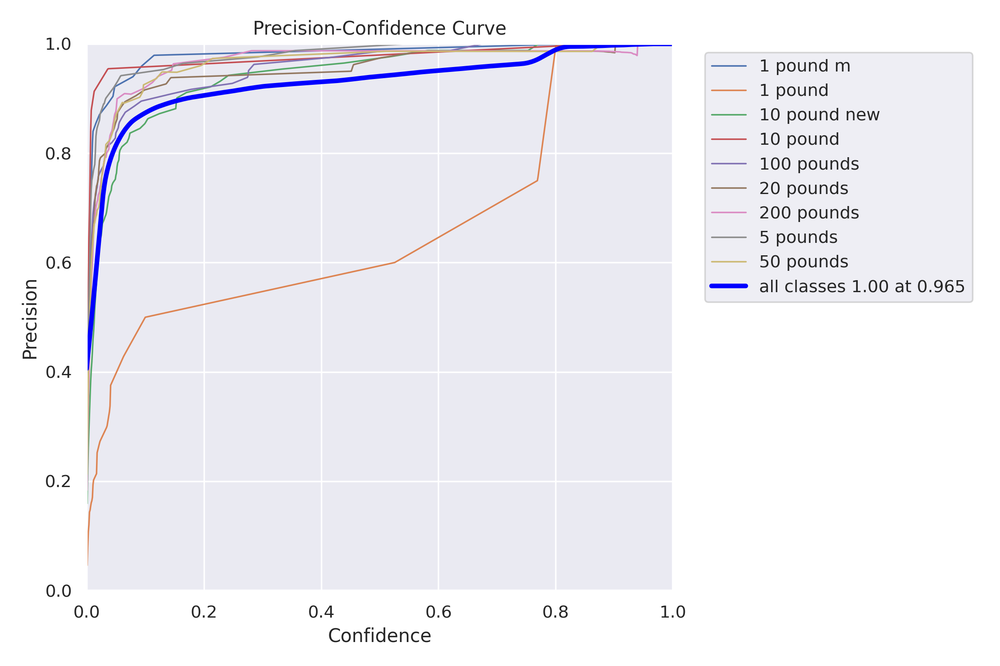
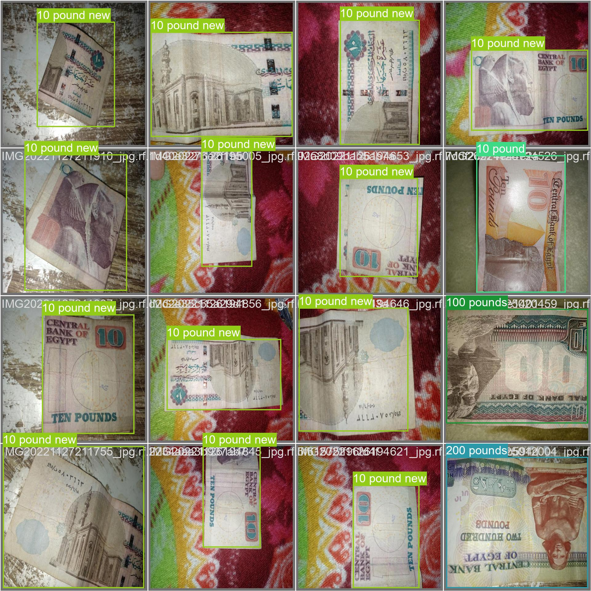
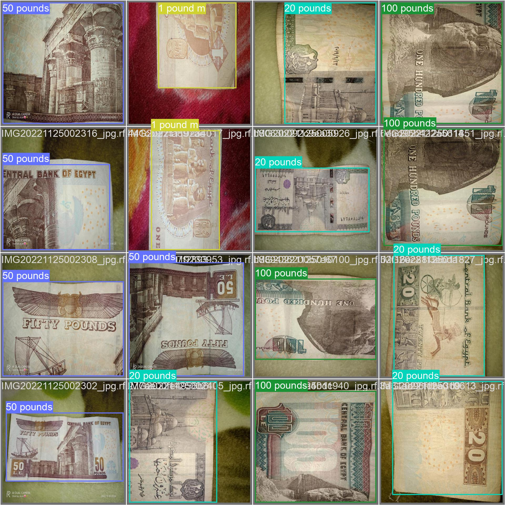

Sure, here's an updated version of the Markdown file with more details:

# Egy-Currency-Detectron

This repository contains code for detecting and recognizing Egyptian currency using YOLOv8.

## Introduction

YOLOv8 is a popular and powerful object detection model that uses a single neural network to predict bounding boxes and class probabilities directly from full images in one evaluation. In this project, we use YOLOv8 to detect and recognize Egyptian currency notes.

## Dataset

We used a dataset of Egyptian currency notes that we found at [roboflow](https://roboflow.com/). The dataset consists of 5 classes of currency notes: 1 EGP, 5 EGP, 10 EGP, 20 EGP, 200 EGP , and 50 EGP. The dataset contains a total of 2700 images with bounding box annotations for each currency note.
## Model

We fine-tuned the pre-trained YOLOv8 model on our dataset using [Ultralytics](https://github.com/ultralytics/ultralytics) implementation . Ultralytics is an open source repository that is used to train YOLO models. The YOLOv8 model is a modified version of YOLOv5 that uses a larger backbone network and more training data to achieve better performance.

## Requirements

* Python 3.x
* PyTorch
* OpenCV

## Installation

1. Clone the repository:

   ```
   git clone https://github.com/husseinmleng/Egy-Currency-Detectron.git
   ```

2. Install the dependencies:

   ```
   pip install -r requirements.txt
   ```

3. Download the trained weights best.pt and place them in the `weights` directory.

## Usage

To detect and recognize currency from an image, run the following command:

```
python detect.py --image <path_to_image>
```

For example:

```
python detect.py --image test_images/image1.jpg
```

## Results

Below are some examples of the currency detection and recognition results:





As shown in the results, our model is able to accurately detect and recognize the different classes of Egyptian currency notes.